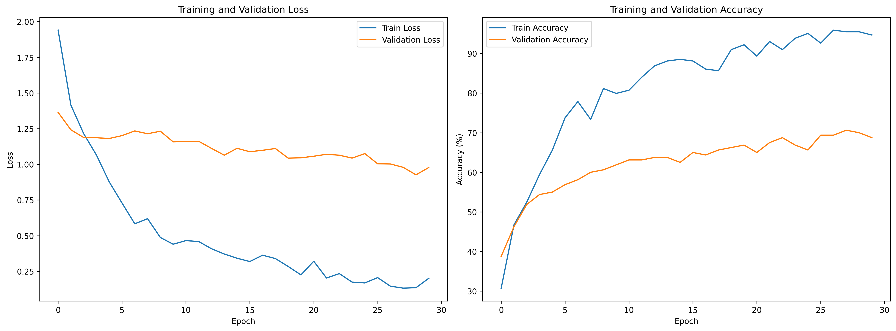
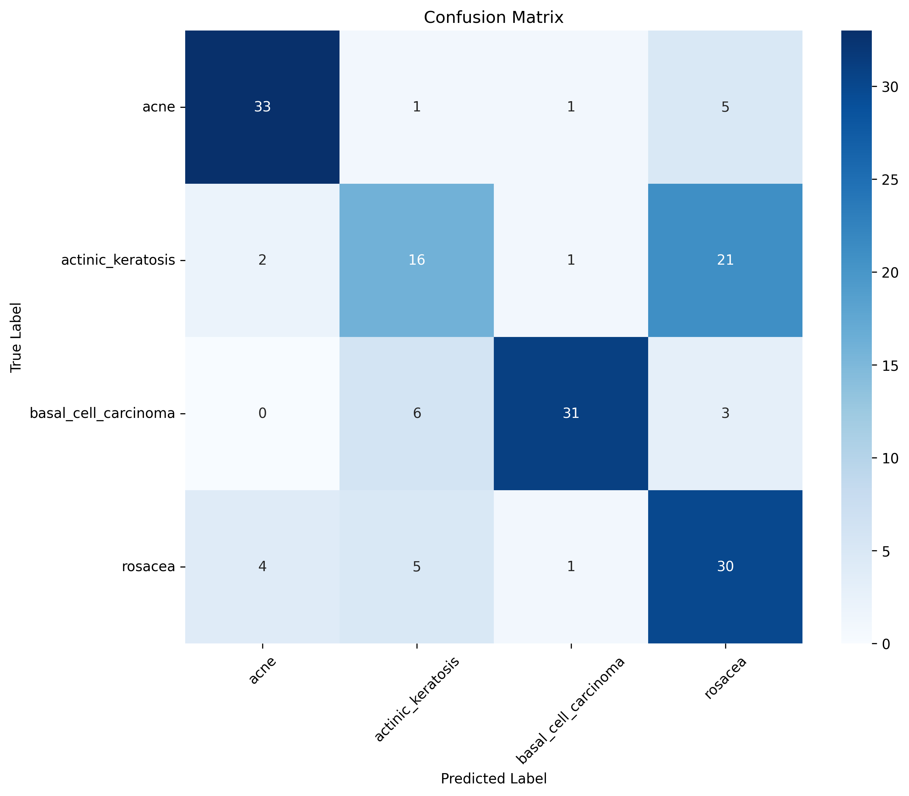

```markdown
# AI Dermatologist - Intelligent Skin Disease Diagnosis System

## Система диагностики заболеваний кожи с использованием искусственного интеллекта

[](https://python.org/)
[](https://fastapi.tiangolo.com/)
[](https://reactjs.org/)
[](https://www.typescriptlang.org/)
[](https://pytorch.org/)
[](https://rxnav.nlm.nih.gov/)

---

## Оглавление

1. [Описание проекта](#описание-проекта)
2. [Ключевые возможности](#ключевые-возможности)
3. [Архитектура](#архитектура)
4. [ML модель классификации](#ml-модель-классификации)
5. [RxNorm API интеграция](#rxnorm-api-интеграция)
6. [Технологический стек](#технологический-стек)
7. [Установка и запуск](#установка-и-запуск)
8. [API эндпоинты](#api-эндпоинты)
9. [Структура проекта](#структура-проекта)
10. [Результаты модели](#результаты-модели)
11. [Планы развития](#планы-развития)

---

## Описание проекта

Интеллектуальная система для анализа изображений кожи и диагностики дерматологических заболеваний с использованием глубокого обучения и интеграции с медицинской базой лекарственных средств RxNorm.

**Цель:** Создать инструмент для первичной самодиагностики, позволяющий:
- Анализировать фотографии кожи и определять заболевание
- Визуализировать проблемные участки с помощью тепловых карт
- Получать рекомендации по лечению, включая реальные лекарственные препараты
- Формировать персонализированный план ухода за кожей

> Важно: Результаты анализа носят справочный характер и не заменяют консультацию врача-дерматолога.

---

## Ключевые возможности

### 1. Анализ изображений
- Загрузка фотографий кожи (JPG, JPEG, PNG)
- Drag-and-drop интерфейс
- Определение 4 типов заболеваний
- Автоматическое определение здоровой кожи при низкой уверенности

### 2. Визуализация (Grad-CAM)
- Тепловая карта проблемных зон
- Ограничивающие рамки с указанием заболевания
- Интерактивная разметка с возможностью клика
- Модальное окно с детальной информацией

### 3. Лекарственные рекомендации (RxNorm)
- Поиск препаратов по действующему веществу
- Разделение на рецептурные и безрецептурные
- Информация о механизме действия
- Список побочных эффектов
- Система предупреждений о рисках (critical/high/moderate)

### 4. Персональные рекомендации
- Первая линия терапии
- Рекомендуемые ингредиенты
- Утренняя и вечерняя рутина ухода
- Общие рекомендации
- Сезонные советы

---

## Архитектура

```
┌─────────────────────────────────────────────────────────────────┐
│                         FRONTEND (React)                         │
│   UploadArea    │    Results     │  ImageAnnotator  │  Modals   │
└─────────────────────────────────────────────────────────────────┘
                                    │
                                    │ REST API (Axios)
                                    ▼
┌─────────────────────────────────────────────────────────────────┐
│                      BACKEND (FastAPI)                           │
│     Routes      │  SkinAnalyzer   │  TreatmentGenerator  │      │
└─────────────────────────────────────────────────────────────────┘
                                    │
                    ┌───────────────┼───────────────┐
                    ▼               ▼               ▼
              ┌──────────┐   ┌──────────┐   ┌──────────┐
              │ PyTorch  │   │ RxNorm   │   │  Local   │
              │  Model   │   │   API    │   │ Database │
              └──────────┘   └──────────┘   └──────────┘
```

---

## ML модель классификации

### Архитектура

| Компонент | Описание |
|-----------|----------|
| **Базовая модель** | EfficientNet-B0 (предобучена на ImageNet) |
| **Выход** | 4 класса (acne, actinic_keratosis, basal_cell_carcinoma, rosacea) |
| **Признак здоровой кожи** | Автоматическое определение при max confidence < 0.5 |

### Пайплайн обучения

```
1. Загрузка предобученной модели
2. Заморозка всех слоёв
3. Разморозка последних 3 блоков
4. Добавление классификационной головы:
   - Dropout(0.7)
   - Linear(1280, 256)
   - ReLU
   - BatchNorm1d(256)
   - Dropout(0.35)
   - Linear(256, 4)
5. Аугментация данных
6. Оптимизация: Adam, weight_decay=1e-4
7. Learning Rate scheduling (ReduceLROnPlateau)
8. Early stopping (patience=10)
```

### Аугментация данных (для тренировочной выборки)

| Трансформация | Параметры |
|---------------|-----------|
| RandomHorizontalFlip | p=0.5 |
| RandomVerticalFlip | p=0.3 |
| RandomRotation | 20 градусов |
| ColorJitter | brightness=0.2, contrast=0.2, saturation=0.2, hue=0.1 |
| RandomAffine | translate=(0.1, 0.1), scale=(0.9, 1.1) |
| RandomResizedCrop | scale=(0.8, 1.0) |

### Grad-CAM визуализация

Метод генерации тепловых карт активаций:

```
1. Получение активаций последнего свёрточного слоя
2. Получение градиентов относительно целевого класса
3. Вычисление весов (глобальное среднее пулирование градиентов)
4. Взвешенное суммирование карт активаций
5. ReLU и нормализация
6. Наложение на исходное изображение
7. Формирование ограничивающих рамок
```

---

## RxNorm API интеграция

### Обзор

RxNorm - открытый API Национальной медицинской библиотеки США, предоставляющий нормализованные названия лекарственных средств.

### Архитектура интеграции

```
┌─────────────────────────────────────────────────────────────────┐
│                      TreatmentGenerator                          │
│                                                                  │
│   1. Определение заболевания из анализа                          │
│   2. Маппинг на действующие вещества                             │
│   3. Запрос к локальной базе лекарств                            │
│   4. Получение детальной информации                              │
│   5. Формирование рекомендаций                                   │
│                                                                  │
└─────────────────────────────────────────────────────────────────┘
                                    │
                                    │ HTTPS (при необходимости)
                                    ▼
┌─────────────────────────────────────────────────────────────────┐
│                      RxNorm REST API                             │
│                                                                  │
│   Эндпоинты:                                                     │
│   - /drugs?name={ingredient}                                    │
│   - /drug/{rxcui}/allProperties                                 │
│   - /interaction/list.json?rxcuis={list}                        │
│                                                                  │
└─────────────────────────────────────────────────────────────────┘
```

### Маппинг заболеваний

| Заболевание | Действующие вещества |
|-------------|----------------------|
| Акне | изотретиноин, третиноин, адапален, клиндамицин, бензоил пероксид, салициловая кислота |
| Розацеа | метронидазол, азелаиновая кислота, ивермектин, доксициклин, бримонидин |
| Актинический кератоз | фторурацил, имиквимод, диклофенак, ингенол мебутат |
| Базально-клеточная карцинома | висмодегиб, сонидегиб, фторурацил, имиквимод |

### Структура данных препарата

```json
{
  "name": "Изотретиноин",
  "generic_name": "isotretinoin",
  "brand_names": ["Аккутан", "Роаккутан", "Сотрет"],
  "drug_class": "Ретиноид",
  "how_it_works": "Уменьшает выработку кожного сала",
  "side_effects": ["Сухость кожи", "Фотосенсибилизация"],
  "warning": "Тератогенен. Требуется контрацепция.",
  "prescription_required": true,
  "risk_level": "critical"
}
```

---

## Технологический стек

### Frontend
| Технология | Назначение |
|------------|------------|
| React 18 | UI библиотека |
| TypeScript | Типизация |
| Vite | Сборка проекта |
| Axios | HTTP-клиент |
| React Dropzone | Drag-and-drop загрузка |

### Backend
| Технология | Назначение |
|------------|------------|
| Python 3.10 | Язык программирования |
| FastAPI | Веб-фреймворк |
| PyTorch | Глубокое обучение |
| Torchvision | Предобученные модели |
| Uvicorn | ASGI-сервер |

### Medical API
| Технология | Назначение |
|------------|------------|
| RxNorm API | Медицинская база лекарств |
| Grad-CAM | Визуализация активаций |

---

## Установка и запуск

### Требования
- Python 3.10+
- Node.js 18+
- 8GB RAM (рекомендуется)
- GPU (опционально, для ускорения)

### 1. Клонирование репозитория

```bash
git clone https://github.com/Katena1906/AiSkin.git
cd AiSkin
```

### 2. Настройка бэкенда

```bash
cd backend

# Создание виртуального окружения
python -m venv venv
source venv/bin/activate  # Linux/Mac
venv\Scripts\activate     # Windows

# Установка зависимостей
pip install -r requirements.txt

# Запуск сервера
python app/web_app.py
```

Сервер запустится на `http://localhost:8001`

### 3. Настройка фронтенда

```bash
cd frontend

# Установка зависимостей
npm install

# Запуск dev сервера
npm run dev
```

Приложение будет доступно по адресу: `http://localhost:3000`

---

## API эндпоинты

### Анализ

| Метод | Эндпоинт | Описание |
|-------|----------|----------|
| GET | `/api/health` | Проверка состояния сервера |
| POST | `/api/analyze` | Анализ изображения |

### История

| Метод | Эндпоинт | Описание |
|-------|----------|----------|
| GET | `/api/history` | Получение истории анализов |
| DELETE | `/api/history/{id}` | Удаление записи из истории |

### Пример ответа `/api/analyze`

```json
{
  "success": true,
  "analysis": {
    "disease": "acne",
    "confidence": 0.87,
    "all_probabilities": {
      "acne": 0.87,
      "rosacea": 0.08,
      "actinic_keratosis": 0.03,
      "basal_cell_carcinoma": 0.02,
      "healthy": 0.00
    },
    "needs_doctor": false,
    "heatmap": "data:image/png;base64,...",
    "bounding_boxes": [
      {
        "x": 25,
        "y": 30,
        "width": 15,
        "height": 12,
        "label": "acne",
        "confidence": 0.87
      }
    ]
  },
  "recommendations": {
    "treatment_plan": {
      "explanation": "Акне возникает при закупорке сальных желёз",
      "treatment_goals": ["Уменьшить выработку кожного сала", "Очистить поры"],
      "first_line_treatments": ["Бензоил пероксид", "Салициловая кислота"],
      "prescription_medications": [...],
      "otc_recommendations": [...],
      "doctor_consultation_required": false
    },
    "skincare_routine": {
      "morning": ["Мягкое очищение", "Легкий увлажняющий крем", "SPF 30+"],
      "evening": ["Двойное очищение", "Сыворотка с ниацинамидом", "Увлажняющий крем"]
    },
    "general_advice": ["Очищайте кожу дважды в день", "Используйте некомедогенные средства"]
  }
}
```

---

## Структура проекта

```
AiSkin/
├── backend/
│   ├── app/
│   │   ├── web_app.py              # FastAPI приложение
│   │   ├── skin_analyzer.py        # Обёртка модели + Grad-CAM
│   │   ├── rxnorm_api.py           # Интеграция с RxNorm
│   │   ├── smart_parser.py         # Генератор лечения
│   │   ├── drug_data.json          # База лекарственных средств
│   │   ├── history_manager.py      # Управление историей
│   │   ├── ingredient_analyzer.py  # Анализ ингредиентов
│   │   └── product_comparator.py   # Сравнение продуктов
│   └── requirements.txt
│
├── frontend/
│   ├── src/
│   │   ├── components/
│   │   │   ├── UploadArea.tsx      # Загрузка изображений
│   │   │   ├── Results.tsx         # Отображение результатов
│   │   │   ├── ProbabilityBar.tsx  # Полоса вероятностей
│   │   │   ├── ImageAnnotator.tsx  # Разметка изображения
│   │   │   ├── BoxDetailsModal.tsx # Модальное окно
│   │   │   └── ProductCard.tsx     # Карточка продукта
│   │   ├── services/
│   │   │   └── api.ts              # API клиент
│   │   ├── types/
│   │   │   └── index.ts            # TypeScript типы
│   │   ├── App.tsx
│   │   ├── App.css
│   │   └── main.tsx
│   ├── package.json
│   └── vite.config.ts
│
├── skin_model/                     # Модель и обучение
│   ├── model.py                    # Архитектура EfficientNet-B0
│   ├── train.py                    # Скрипт обучения
│   ├── dataset.py                  # Датасет и аугментации
│   ├── predict.py                  # Инференс
│   └── test.py                     # Тестирование
│
├── saved_models/                   # Обученные веса
│   ├── final_model.pth
│   ├── classification_report.json
│   └── confusion_matrix.png
│
└── data/                          # Датасет с изображениями
    ├── train/
    ├── val/
    └── test/
```

---

## Результаты модели

### Метрики на тестовой выборке

| Класс | Precision | Recall | F1-score | Support |
|-------|-----------|--------|----------|---------|
| Акне | 0.85 | 0.82 | 0.84 | 40 |
| Актинический кератоз | 0.57 | 0.40 | 0.47 | 40 |
| Базально-клеточная карцинома | 0.91 | 0.78 | 0.84 | 40 |
| Розацеа | 0.51 | 0.75 | 0.61 | 40 |

**Общая точность:** 70.75%

### Анализ результатов

| Показатель | Значение | Интерпретация |
|------------|----------|---------------|
| Лучший класс | BCC (91% precision) | Отличное распознавание рака кожи |
| Худший класс | Actinic keratosis (47% F1) | Путается с BCC и rosacea |
| Проблема | Recall AK = 40% | Много false negatives |
| Проблема | Precision rosacea = 51% | Много false positives |

### График обучения



### Матрица ошибок



---

## Планы развития

### Краткосрочные (3-6 месяцев)
- Увеличение датасета для актинического кератоза и розацеа
- Промышленная аугментация (MixUp, CutMix)
- Добавление Cross-Validation для стабильности

### Среднесрочные (6-12 месяцев)
- Поддержка английского языка
- Система авторизации пользователей
- Экспорт отчётов в PDF

### Долгосрочные (1+ год)
- Интеграция с электронными медицинскими картами
- Система напоминаний о приёме препаратов

---

## Лицензия

MIT

---

## Контакты

- Автор: Katena1906
- GitHub: [https://github.com/Katena1906](https://github.com/Katena1906)
- Репозиторий: [https://github.com/Katena1906/AiSkin](https://github.com/Katena1906/AiSkin)

---

**Система разработана в рамках проекта по интеллектуальной диагностике заболеваний кожи с использованием глубокого обучения и интеграции с медицинскими API.**
```